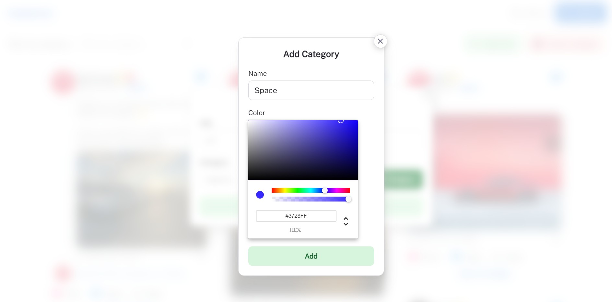
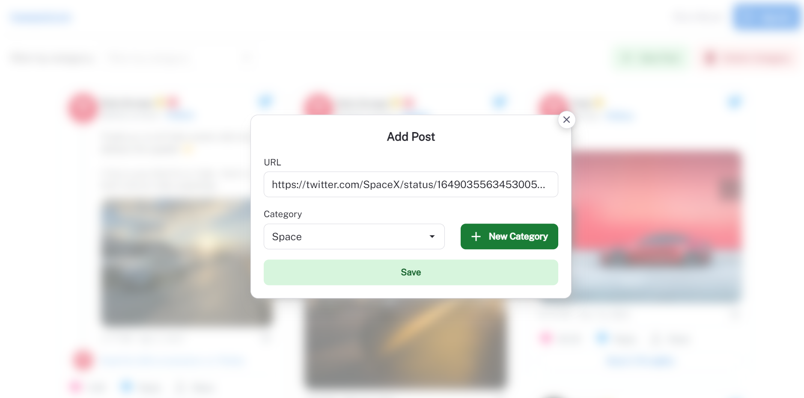

# Quick overview

Tweexicon is a web application that provides a simple solution for saving and organizing tweets into categories. With Tweexicon, users can save tweets by providing their URLs and selecting one of the previously created categories for the tweet. This app is designed to help users easily keep track of important tweets, whether it's for personal or professional use. The app is user-friendly and easy to use, allowing users to quickly categorize and access their saved tweets whenever they need them.

# Database

Tweexicon is a web application that allows users to save and organize tweets into categories. The MongoDB database for Tweexicon consists of two collections: "users" and "posts".

The "users" collection stores information about each user and contains the following fields:

- id: a unique identifier for each user.
- firstName: the user's first name.
- lastName: the user's last name.
- email: the user's email address.
- password: a hashed representation of the user's password.
- categories: an array of category objects, each containing an id, name, and color.

The "posts" collection stores information about each saved tweet and contains the following fields:

- id: a unique identifier for each saved tweet.
- userId: the id of the user who saved the tweet.
- url: the URL of the tweet being saved.
- categoryName: the name of the category that the tweet belongs to.
- createdAt: the time at which the tweet was saved.

In addition to the default index created for the primary key (id) in the "posts" and "users" collections, an additional index has been manually added to the "posts" collection. This index is created for the "userId" field, which is frequently queried in the application.

By indexing the "userId" field in the "posts" collection, we can improve the performance of queries that require retrieving posts belonging to a specific user. This index allows MongoDB to quickly locate the relevant posts, rather than having to scan through the entire collection.

# security

For user password protection, every password is hashed and salted before being stored in the database. This helps to ensure that even if the database is compromised, the user's password remains protected.

we also use JWT (JSON Web Token) for authentication. JWT is a compact and secure way of transmitting information between parties as a JSON object. In Tweexicon, JWT is used to authenticate users and authorize access to the application. When a user logs in, Tweexicon generates a JWT that includes the user's ID and other relevant information. This token is then sent to the client and stored in a cookie.

On subsequent requests, the client sends the JWT back to the server to authenticate the user and authorize access to the requested resources. JWTs are cryptographically signed, ensuring that the contents of the token cannot be tampered with. This provides an added layer of security for the application.

# API design

## Public Endpoints

### POST /signup

The `/signup` endpoint allows users to create a new account. Users provide their first name, last name, email, and password, which is hashed and stored securely in the database.

### POST /signin

The `/signin` endpoint allows users to authenticate and receive a JWT that will be used for accessing auth-protected endpoints. Users provide their email and password, and if the provided credentials match a user in the database, Tweexicon returns a JWT.

## Auth-Protected Endpoints

Auth-protected endpoints require a valid JWT to access.

### GET /posts

The `/posts` endpoint returns a list of posts for the authenticated user, with optional pagination parameters. The `cursor` parameter is the ID of the last post returned in the previous request or the first post based on the direction. The `limit` parameter specifies the maximum number of posts to return. The `dir` parameter specifies the direction of pagination, either "next" or "previous".

### Pagination: 

We are using cursor-based pagination in the previous endpoints. Cursor-based pagination uses a unique identifier (cursor) to mark the last item in a page of results. This cursor is then used as the starting point for the next page of results. This approach offers several benefits, such as avoiding the issue of page drift when new items are added, and providing a more consistent user experience.

Cursor-based pagination can scale easily because it does not depend on the total number of items in the database, unlike offset-based pagination. As the number of items in the database grows, the time it takes to compute the offset for the next page increases, which can cause performance issues. In contrast, cursor-based pagination uses a fixed-size page and a unique identifier, which means that the query for the next page is constant time and doesn't depend on the number of items in the database.

### GET /posts/:category

The `/posts/:category` endpoint returns a list of posts for a specific category, with optional pagination parameters. The `category` parameter is the name of the category to retrieve posts for. The `cursor`, `limit`, and `dir` parameters are the same as in the `/posts` endpoint.

### POST /posts

The `/posts` endpoint allows users to add a new post to the database. Users provide the URL of the tweet, the name of the category to add the post to, and the creation time of the post.

### DELETE /posts/:post_id

The `/posts/:post_id` endpoint allows users to delete a post from the database. Users provide the ID of the post to delete.

### GET /categories

The `/categories` endpoint returns a list of categories for the authenticated user.

### POST /categories

The `/categories` endpoint allows users to add a new category. Users provide the name and color of the category to add.

### DELETE /categories/:categoryName

The `/categories/:categoryName` endpoint allows users to delete a category. Users provide the name of the category to delete.

# Frontend

For the frontend, we are using Material UI as a React component library. Material UI offers a set of pre-built components that make it easy to create a consistent and modern-looking UI. Additionally, we are using the React Query library in some components. React Query provides an elegant way to manage and update server state in the client-side.

In terms of displaying tweets, we are using the Twitter OEmbed API. This API allows us to embed a tweet in a web page by simply providing its URL. By using this API, we can display tweets as they appear on Twitter, complete with media, links, and other embedded content.

The frontend of Tweexicon is designed to be responsive. This means that the layout and design of the app will adapt to different screen sizes and devices. Additionally, the UI is designed to be intuitive and user-friendly, with clear navigation and feedback

here are some screenshots of tweexicon:
### Main Page

### Add Category

### Add Post

### Filter tweets by category

# deployment

For deployment, I am planning to use the free tier of one of the cloud providers in the GitHub Student Pack after containerizing the application.

Tweexicon will have a custom domain name and it will be secured using TLS certificate.